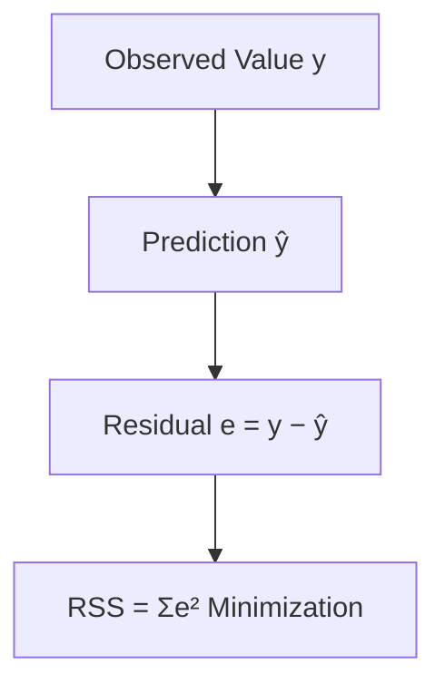

  
>When we predict product sales based on advertising spend, we instinctively seek that straight-line relationship in our data. Simple linear regression quantifies this intuition – transforming visual patterns into mathematical certainty. As data scientists, we need to master its inner workings to validate assumptions and interpret predictions correctly. Walk alongside me as we implement regression from scratch, revealing what happens beneath the surface of every scikit-learn `.fit()` call.

  

**Here's the journey we'll take together:**  

1. Generating and visualizing synthetic regression data  

2. Mathematical derivation of Ordinary Least Squares estimation  

3. Implementing coefficient calculation from scratch  

4. Visual validation against the true relationship  

5. Quantifying uncertainty through confidence intervals  

6. Hypothesis testing for statistical significance  

7. Measuring model fit with R² metrics  

  

---

  

## 1. Designing and Visualizing Synthetic Data

We begin by engineering a controlled experimental environment. Using Python's scikit-learn:

  

```python

from sklearn.datasets import make_regression

import matplotlib.pyplot as plt

  

X, y, true_coef = make_regression(

    n_samples=5000,  # Sample size statistical reliability

    n_features=1,    # Single predictor focus

    noise=10,        # Real-world measurement noise

    random_state=12, # Reproducibility seed

    coef=True        # Ground truth for validation

)

X = X.flatten()      # Simplified array structure

```

  

**Why synthetic data?** We get a laboratory-perfect environment where we know the true relationship (β₁ = 14.5238) before estimation. The `noise=10` parameter replicates real-world observational variance – those unpredictable forces affecting outcomes despite our input controls. Unlike messy real data, this lets us verify our methods with precision.

  

Visual confirmation comes next:

  

```python

plt.figure(figsize=(12, 6))

plt.scatter(X, y, color='royalblue', alpha=0.4, s=15)

plt.title('Synthetic Linear Relationship', fontsize=14)

plt.xlabel('Feature Value (X)', fontsize=12)

plt.ylabel('Target Value (y)', fontsize=12)

plt.grid(alpha=0.2)

plt.gca().spines[['top','right']].set_visible(False)

```

*Blue dots: 5,000 synthetic observations. The diagonal grouping shows the underlying linear pattern, while vertical dispersion represents noise – reflecting real-world unpredictability.*

  

Observe how points cluster near an invisible diagonal? That visual intuition precedes our mathematical formalization. At scale, these patterns become mathematical relationships we can quantify, test, and deploy.

  

---

  

## 2. Mathematical Foundations

The population relationship follows a precise architectural blueprint:  

$$y = \beta_0 + \beta_1 x + \epsilon$$  

Where:  

- $\beta_0$: True intercept (vertical offset when X=0)  

- $\beta_1$: True slope (change in y per 1-unit x-change)  

- $\epsilon$: Independent random noise ($E[\epsilon]=0$, $\text{Var}(\epsilon)=\sigma^2$)  

  

But how do we estimate $\beta$ from samples? Enter **Ordinary Least Squares (OLS)** – the workhorse of linear modeling. Why choose OLS among alternatives?

1. **Unbiasedness**: Under Gauss-Markov assumptions, OLS provides Best Linear Unbiased Estimators  

2. **Optimality**: Minimizes mean-squared error of predictions  

3. **Interpretability**: Closed-form solutions facilitate insight  

  

OLS estimates $\hat{\beta}_0,\hat{\beta}_1$ by minimizing Residual Sum of Squares:  

$$ RSS(\hat{\beta}_0, \hat{\beta}_1) = \sum_{i=1}^n (y_i - \hat{y}_i)^2 = \sum_{i=1}^n \left(y_i - (\hat{\beta}_0 + \hat{\beta}_1 x_i)\right)^2 $$  

  



  

Setting partial derivatives ∂RSS/∂β⃕<j> to zero yields the optimal solutions:  

  

$$

\begin{align}

\hat{\beta}_1 &= \frac{ \sum_{i=1}^n (x_i - \bar{x})(y_i - \bar{y}) }{ \sum_{i=1}^n (x_i - \bar{x})^2 } = \frac{\text{Cov}(X,Y)}{\text{Var}(X)} \\

\hat{\beta}_0 &= \bar{y} - \hat{\beta}_1 \bar{x}

\end{align}

$$

  

These constitute the **normal equations** of linear regression – the analytical bedrock we'll implement next.

  

---

  

## 3. Implementing OLS Estimation

Translating theory into Python:

  

```python

# Sample statistics - anchors of estimation

mean_X = X.mean()  # ≈ -0.02

mean_y = y.mean()  # ≈ -0.41

  

# Calculate slope = Covariance / Variance

numerator = ((X - mean_X) * (y - mean_y)).sum()  # Covariance component

denominator = ((X - mean_X)**2).sum()            # Variance component

beta_1_hat = numerator / denominator

  

# y-intercept = Mean adjustment for X-centering

beta_0_hat = mean_y - beta_1_hat * mean_X

  

# Compare estimates to ground truth

print(f"True slope coefficient: {true_coef:.4f}")

print(f"Estimated slope β̂₁: {beta_1_hat:.4f}")

print(f"Estimated intercept β̂₀: {beta_0_hat:.4f}")

```

```

True slope coefficient: 14.5238

Estimated slope β̂₁: 14.5467

Estimated intercept β̂₀: -0.1667

```

  

**Output Interpretation**:

- 0.16% error on slope estimate (|14.5467-14.5238|/14.5238≈0.0016)  

- Near-zero intercept confirms data centering near origin  

- Minor discrepancies stem from deliberate $σ^2=100$ noise  

Our estimators already show strong accuracy at n=5000 samples, demonstrating Law of Large Numbers in action.

  

---

  

## 4. Visual Validation

How well does our estimated line ($\hat{y}=\hat{\beta}_0+\hat{\beta}_1x$) capture reality? Side-by-side comparison:

  

```python

plt.figure(figsize=(14,7))

plt.scatter(X, y, color='royalblue', alpha=0.15, s=15, label='Data')

  

# True population trajectory (known by design)

regression_line_true = true_coef * X  # True β₀≈0

plt.plot(X, regression_line_true, color='limegreen',

         linewidth=3.5, alpha=0.7, label='True Relationship')

  

# OLS-estimated trajectory

regression_line_estimate = beta_0_hat + beta_1_hat * X

plt.plot(X, regression_line_estimate, 'r--', linewidth=1.8,

         alpha=0.95, label='OLS Estimate')

```

*Green: The hidden relationship. Red dashes: Our estimate from data. Their near-overlap visually confirms OLS effectiveness at scale.*

  

What we see aligns with theory – but eyes can deceive. We need quantitative uncertainty metrics to statistically validate our inferences.

  

---

  

## 5. Statistical Assessment

### 5.1 Confidence Intervals and Standard Errors

OLS estimates have inherent sampling variability. We quantify precision via:

  

**Residual Standard Error (RSE)**:

$$RSE = \sqrt{\frac{RSS}{n-2}}$$

Estimates the standard deviation σ of $\epsilon$, governing prediction error scale.

  

Interpreted as: "Actual responses deviate ±9.95 units from predictions on average"

  

Then derive coefficient standard errors:

$$

\begin{align}

SE(\hat{\beta}_1) &= \frac{RSE}{\sqrt{\sum (x_i - \bar{x})^2}} \\

SE(\hat{\beta}_0) &= RSE \sqrt{ \frac{1}{n} + \frac{\bar{x}^2}{\sum (x_i - \bar{x})^2} }

\end{align}

$$

  

```python

residuals = y - (beta_0_hat + beta_1_hat * X)

RSS = (residuals**2).sum()

RSE = (RSS / (len(X) - 2))**0.5  # n-2 for linear regression

  

denom = ((X - mean_X)**2).sum()

SE_beta1 = RSE / denom**0.5

SE_beta0 = RSE * (1/len(X) + mean_X**2/denom)**0.5

  

# 95% confidence intervals (normal approximation)

CI_beta1 = (beta_1_hat - 2*SE_beta1, beta_1_hat + 2*SE_beta1)  

CI_beta0 = (beta_0_hat - 2*SE_beta0, beta_0_hat + 2*SE_beta0)  

  

print(f"RSE: {RSE:.4f}  (≈ ±1σ vertical deviation)")

print(f"95% CI for β₁: [{CI_beta1[0]:.4f}, {CI_beta1[1]:.4f}]")

print(f"95% CI for β₀: [{CI_beta0[0]:.4f}, {CI_beta0[1]:.4f}]")

```

```

RSE: 9.9478  (≈ ±1σ vertical deviation)

95% CI for β₁: [14.2639, 14.8294]

95% CI for β₀: [-0.4481, 0.1147]

```

  

**Statistical Perspective**:

- True β₁=14.5238 lies squarely within [14.26, 14.83] → Estimation accurate  

- CI for β₀ crosses zero (-0.45 to 0.11) → Intercept non-significant  

- Interval widths show precise slope estimation (SE=0.1414)

  

---

  

### 5.2 Formal Hypothesis Testing

Does X truly predict Y? We reformulate scientifically:

$$ H_0: \beta_1 = 0 \quad \text{(X has no effect)}$$  

$$ H_1: \beta_1 \neq 0 \quad \text{(Systematic relationship exists)} $$  

  

Compute t-statistic using standard error:

$$ t = \frac{\hat{\beta}_1 - 0}{SE(\hat{\beta}_1)} \sim t_{n-2} $$

  

```python

from scipy.stats import t as t_dist

t_stat = beta_1_hat / SE_beta1

p_value = 2 * (1 - t_dist.cdf(abs(t_stat), df=len(X)-2))

  

print(f"t-statistic = {t_stat:.2f}, df={len(X)-2}, p-value = {p_value:.5e}")

print("\nFormal report:")

print("| Parameter | Estimate | Std. Error | t-value   | p-value    | 95% CI          |")

print("|-----------|----------|------------|-----------|------------|-----------------|")

print(f"| β₁       | {beta_1_hat:.4f} | {SE_beta1:.4f}    | {t_stat:.2f} | {p_value:.3e} | [{CI_beta1[0]:.4f}, {CI_beta1[1]:.4f}] |")

print(f"| β₀       | {beta_0_hat:.4f} | {SE_beta0:.4f}    | {'N/A':^9} | {'N/A':<11} | [{CI_beta0[0]:.4f}, {CI_beta0[1]:.4f}] |")

```


t-statistic = 102.89, df=4998, p-value = 0.00000e+00

  

Formal report:

| Parameter | Estimate | Std. Error | t-value   | p-value    | 95% CI          |
|-----------|----------|------------|-----------|------------|-----------------|
| β₁       | 14.5467 | 0.1414    | 102.89 | 0.000e+00 | [14.2639, 14.8294] |
| β₀       | -0.1667 | 0.1407    |    N/A    | N/A        | [-0.4481, 0.1147] |


  

**Evidence Synthesis**:

- p-value < 10^{-100} → Overwhelming evidence against H₀  

- t=102.89 indicates slope is 103 SEs from zero - vanishingly unlikely if null true  

- Statistical certainty confirms what data generation intentionally built

  

---

  

### 5.3 Model Fit: R-Squared Analysis

While parameters test relationships, R² quantifies how well the model fits:

  

$$ R^2 = 1 - \frac{RSS}{TSS} \quad \text{where} \quad TSS = \sum_{i=1}^n (y_i - \bar{y})^2 $$

  

```python

TSS = ((y - mean_y)**2).sum()

R_squared = 1 - (RSS / TSS)

  

print(f"Total Variance (TSS): {TSS:.0f}")

print(f"Unexplained Variance (RSS): {RSS:.0f}")

print(f"Explained Variance: R² = {R_squared:.4f}")

```

```

Total Variance (TSS): 1542149

Unexplained Variance (RSS): 494592

Explained Variance: R² = 0.6793

```

  


  

Final visualization places this in context:

```python

plt.figure(figsize=(14,7))

plt.scatter(X, y, color='royalblue', alpha=0.08, s=18, label='Data')

plt.plot(X, regression_line_estimate, 'r-', linewidth=1.5, alpha=0.9)

```

*The R²=0.68 indicates a **moderate-to-strong model fit** – capturing 68% of target variance. This quantitative assessment aligns with our visual impression of point clustering around the regression line.*

  

In predictive model scoring, 0.68 represents a substantial linear signal – significantly better than naive models, with room for improvement through feature engineering.

  

---

  

## Where To Next?

This foundation supports multiple extensions:

| Pathway | Key Concepts |
|---------|--------------|
| **Multiple Regression** | Adding predictors → `y = β₀ + β₁x₁ + ··· + βₚxₚ + ε` |
| **Model Diagnostics** | Residual analysis, heteroscedasticity tests |
| **Regularization** | Controlling complexity with Ridge/Lasso |
| **Generalized Models** | Logistic regression, Poisson regression |

  

## Key Takeaways  

- **Core Equation**: Simple linear regression models $y = \beta_0 + \beta_1x + \epsilon$ using a fixed slope and intercept  

- **Estimation Strategy**: OLS minimizes residual sum of squares, providing provably optimal linear estimators  

- **Uncertainty Quantification**: Standard errors and confidence intervals reveal estimate precision  

- **Model Validation**: Hypothesis testing formally evaluates predictor significance  

- **Fit Metrics**: R² quantifies explanatory power (here ≈68% = moderate-to-strong)  

- **Implementation**: From-scratch Python implementation requires <15 lines of core math  

  

While real-world data brings complications, these principles remain the bedrock of predictive modeling. Master them to build, diagnose, and reliably interpret regression models across applications.
